# Dither

**A self-hosted server and dashboard for e-ink displays.** You compose screens
from extensions, describe *when* each screen should be showing, and the panel on
your wall asks for a picture every fifteen minutes and gets the right one.

It is also the tool for everything else the panel needs: flashing firmware to a
bare ESP32 over USB, linking the accounts your screens read from, watching what
each data source currently answers, and seeing exactly what any device would be
showing right now.

Started as a fork of [usetrmnl/terminus](https://github.com/usetrmnl/terminus)
and rewritten in Next.js. Devices run **stock TRMNL firmware, unmodified** —
nothing here asks you to build a custom image. The wire contract is fixed and
written down in [`docs/device-api-contract.md`](docs/device-api-contract.md).

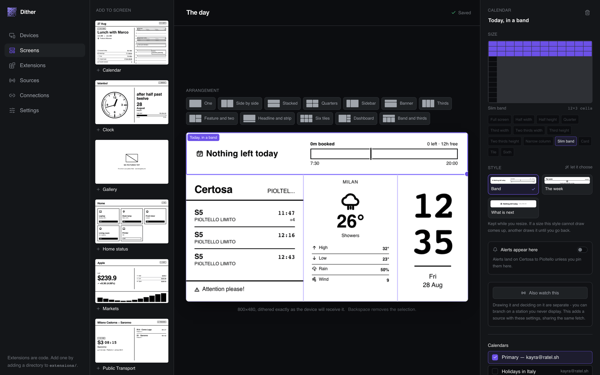

---

## What comes out the other end

Every picture below came off the same server as the screenshots above —
800x480, 1-bit, dithered exactly as the device receives it. No mockups.

<table>
<tr>
<td>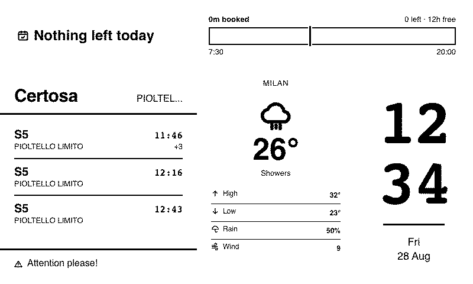</td>
<td>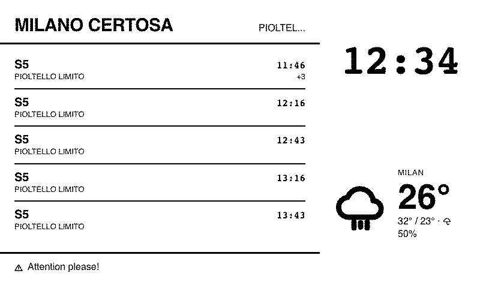</td>
</tr>
<tr>
<td>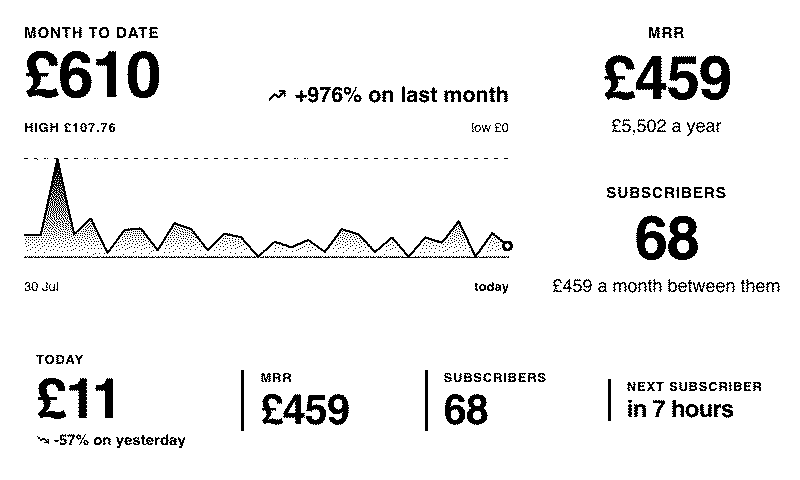</td>
<td>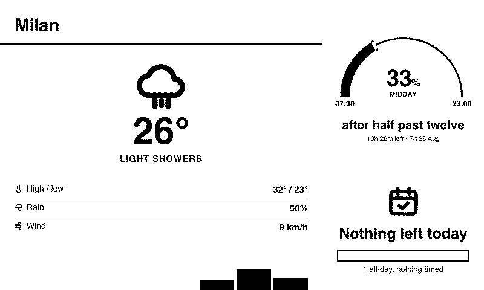</td>
</tr>
</table>

The panel is one bit deep, but the image is dithered on the way out, so a
gradient resolves into a stipple and reads as grey. That is why the area under
the revenue line has depth instead of being a blot.

---

## The idea

The obvious way to build this is to draw a screen and point a device at it. That
falls over the first time you want "clock plus trains" *and* "clock plus
weather" *and* "all three" — three things you own becomes eight screens to
author, and a fourth doubles it again.

So Dither splits the problem in two.

**A screen is a design.** Widgets on a grid, arranged once, drawn well.

**A device decides which screen with a tree.** Walk from the root, answer
questions about the world, show the leaf you land on. Priority is depth — the
question nearest the top is asked first, so "whatever else is going on, when it
rains show the weather" is one node near the root. When the rain stops the tree
simply re-answers and lands wherever it should be *now*, which is why there is
no return stack and no state machine to get stuck in.

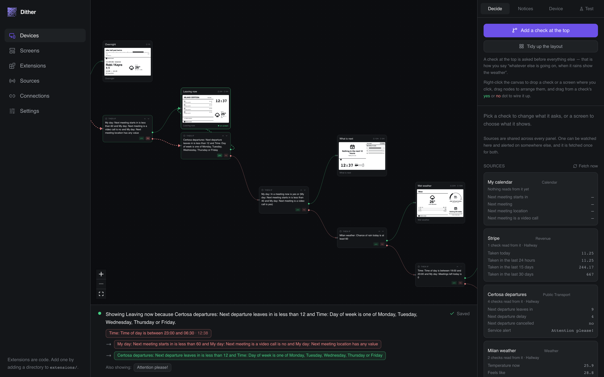

Right-click the canvas to drop a check or a screen, drag from a check's **yes**
or **no** dot to wire it up. The strip along the bottom is the live trace: which
screen this device would be handed if it woke this second, and the exact chain
of answers that got it there.

### The rest of the model

Six more ideas. Each exists because the obvious alternative was tried first and
failed in a way worth remembering.

- **An extension is code; a widget is a use of it.** Extensions ship as
  directories in `extensions/` and are never edited from the dashboard — there
  is no "new extension" button. A widget is one placement of one extension on
  one screen, with *its own* settings and *its own* fetched data. Two train
  routes on one screen is the whole point of the distinction.

- **A source is a question, not a borrowed widget.** Sources belong to the
  installation, not to a screen: the display in the hall can switch screens on
  Milan transit while the one on the desk shows an alert about it, fetched once
  between them. You can watch a station you never display.

- **There is one kind of check: compare a value from a source.** The device is a
  source, the clock is a source, every trigger is a source. A connection that
  reports whether a laptop is awake declares `online: boolean` and the branch is
  immediately buildable — no new check kind, no editor change. `all` / `any`
  group several.

- **A connection is an account, linked once, used by every placement.** An
  extension says "I need Google Calendar" and the linked account answers on
  every screen. Credentials never live in a widget's settings.

- **Notices are the additive half.** The tree is exclusive — you land on exactly
  one leaf. A notice rides on top of whatever screen is showing, in the first
  widget whose extension declares it accepts them.

- **Size is free; the look is a choice; both are refused when undeclared.** A
  widget takes any rectangle on a 12x12 grid. An extension declares *designs* —
  a template plus the range of sizes it will be drawn at — and a size no design
  covers is **refused rather than scaled**, so a full-page design is never
  crammed into a corner. Where several designs cover one size, you pick: that is
  the "style".

---

## The dashboard

### Screens

Every card is a live render at panel resolution, not a thumbnail of a layout.

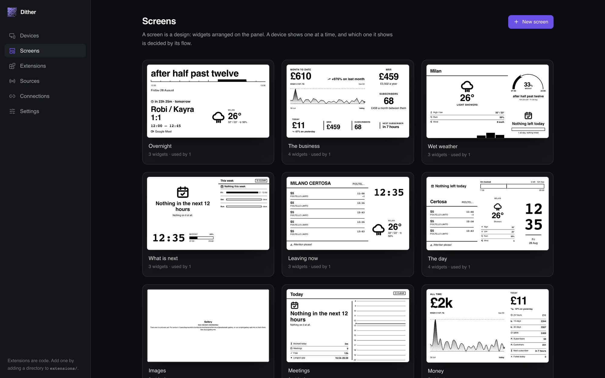

Inside a screen you drag extensions in from the left, choose an arrangement or
draw your own rectangle on the grid, and pick a style per widget. The preview
under the canvas is the same render pipeline the device gets, so what you are
looking at is what will be on the wall.

### Extensions

What screens are built from. Each ships as code and declares the sizes it can be
drawn at, the settings it takes, and the values you can trigger on.

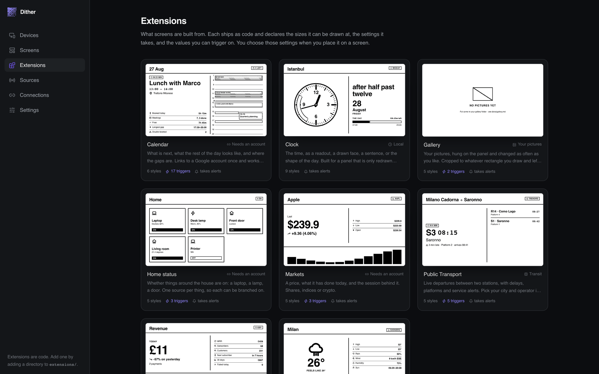

Eight ship in the box:

| Extension | What it shows | Needs |
|---|---|---|
| **Clock** | The time as a readout, a drawn face, a sentence, or the shape of the day | nothing |
| **Weather** | Conditions now and the hours ahead, with range, wind, humidity, daylight | nothing — Open-Meteo, no API key |
| **Public Transport** | Live departures between two stations, with delays, platforms and alerts | pick a city and operator |
| **Calendar** | What is next, what the rest of the day looks like, where the gaps are | a Google account |
| **Revenue** | What came in, what recurs, how many customers, when the next subscriber is due | a Stripe key |
| **Markets** | A price, what it has done today, and the session behind it | stand-in data for now |
| **Home status** | Whether things around the house are on: a laptop, a lamp, a door | stand-in data for now |
| **Gallery** | Your own pictures, cropped to whatever rectangle you draw | a folder of images — see [`docs/gallery.md`](docs/gallery.md) |

The gallery ships with no pictures on purpose. Point `DITHER_GALLERY_DIR` at a
folder, make a subfolder per collection, and copy files in — there is no upload
button and no album table, the same bargain the extension format makes
everywhere else.

### Sources

What Dither watches, and what every device can decide on. A source is fetched
once and read by everything: the checks in a tree, the notices, and the
dashboard itself.

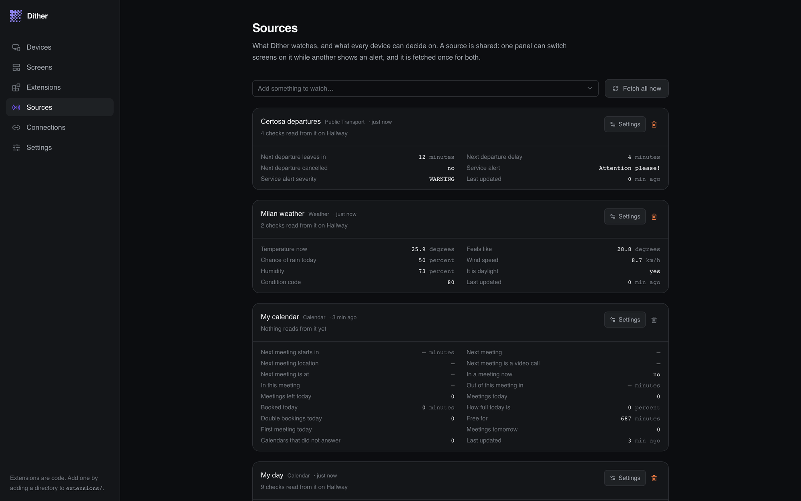

The values you see here are the values a check sees. If a source stops answering
it keeps its last picture with a note over it, but once the answer is older than
the extension's own refresh interval it stops *deciding* — a dead provider
should not silently move a panel to the wrong screen forever.

### Connections

Accounts Dither can read from. Link one once and every widget and trigger that
needs it works, on every screen.

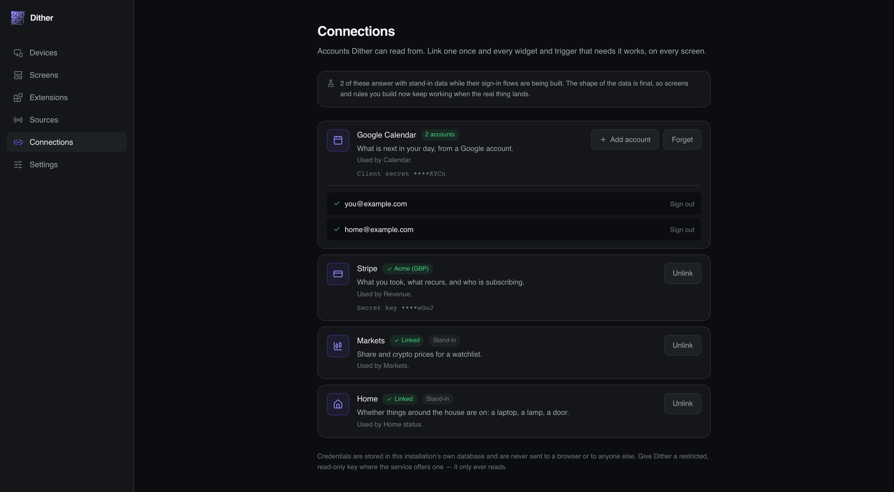

Google takes an OAuth client this installation registers itself, then a consent
screen — see [`docs/google-calendar.md`](docs/google-calendar.md). Stripe takes a
pasted restricted key. Credentials are stored in this installation's own
database and are never sent to a browser or to anyone else.

---

## Panels, and getting firmware onto one

A device is **never created from the dashboard**. It is identified by its MAC
address, the MAC is known to the panel and to nobody else, and the panel
volunteers it the first time it calls `/api/setup` — which provisions it, hands
back a key, and gives it a one-leaf tree so it has something to show before
anyone has touched it.

What you do instead is at `/devices/new`.

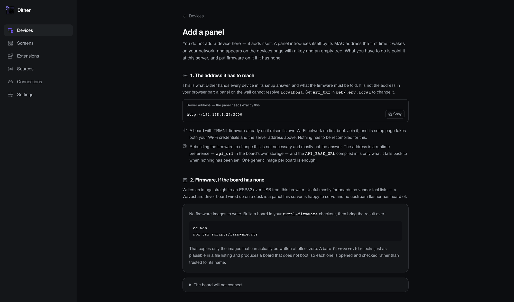

**1. Point it at this server.** Copy the address on that page — `API_URI`, the
address a panel on the wall can reach, not the `localhost` in your browser bar.
A board with TRMNL firmware already on it raises its own Wi-Fi network on first
boot; join it and its setup page takes your Wi-Fi credentials and that address.
Nothing is recompiled for this: the server address is `api_url` in the board's
own storage, and the `API_BASE_URL` compiled into the firmware is only a
fallback. One generic image per board is enough for any number of installations.

**2. Flash it, if the board has none.** The page writes an image straight to an
ESP32 over USB from the browser, via WebSerial. This is mostly for boards no
vendor tool lists — a Waveshare driver board wired up on a desk is a panel this
server is perfectly happy to serve and no upstream flasher has heard of.

Images come from a [`trmnl-firmware`](https://github.com/usetrmnl/trmnl-firmware)
checkout and are never copied in by hand:

```bash
cd web && npx tsx scripts/firmware.mts       # or pass the checkout as an argument
```

That copies only images that can actually be written at offset zero. A bare
`firmware.bin` starts with the same magic byte as a merged image and looks
entirely plausible in a file listing, but written at offset zero it produces a
board that does not boot — so each candidate is opened and its partition table
checked rather than trusted for its name. The binaries are gitignored; the
directory and its README are not.

Forgetting a device is the one direction that *is* a dashboard action, on the
device's card and in its Device tab. It says what goes with it, because the tree
and the notices live here rather than on the panel. A panel still on the network
simply introduces itself again afterwards, as a new device with a new key.

---

## Running it

### With Docker

Two services: the dashboard and device API are one Next.js application, and
Postgres holds screens, devices, trees and the answers fetched for them.
Rendering happens in-process — the app launches a headless Chromium, screenshots
the composed screen and dithers it. There is no separate renderer and no job
queue; a panel wakes every fifteen minutes and asks, which is not a workload
that needs one.

Write a `.env` at the repository root:

```ini
DATABASE_USER=dither
DATABASE_PASSWORD=choose-something
DATABASE_NAME=dither
DATABASE_PORT=5433

PORT=3000
# The address a panel on your network can reach. Not localhost.
API_URI=http://192.168.1.10:3000
```

Then:

```bash
docker compose up -d
```

The dashboard is on <http://localhost:3000>. Images are also published to
`ghcr.io/kayraucklnc/dither` on every push to `main`.

### For development

The same root `.env` above is what `bin/dev` reads for the database password.

```bash
make up      # the shared database, this worktree's .env.local, its dependencies
make dev     # Next, on a port this worktree owns - `make url` prints it
make seed    # a device, screens, sources, a tree. Destructive
make push    # apply this branch's schema
make help    # everything else
```

`make` is a front end for `bin/dev`, which is a front end for docker compose and
npm; anything it does can still be done by hand from `web/`.

There is **one database for every git worktree** — `compose.yml` names its
Compose project, so `make up` anywhere starts, or simply finds, the same
container, and screens seeded in one branch are there in the next. What is not
shared is the port: each worktree claims the first free one from 3001 up, so two
branches can be open in two browser tabs.

---

## Writing an extension

An extension is a directory. Drop one in `extensions/` and Dither picks it up on
the next request — no registration step, no database row, no restart.

```
extensions/tide/
├── configuration.yml           the manifest: settings, facts, where data comes from
├── template.html.liquid        the full-screen design
└── templates/
    ├── half_width.html.liquid
    ├── third_height.html.liquid
    └── ...
```

Scaffold a working one — manifest, sample data, a fact, and four designs
between them covering every shape — so the first thing you see is a render
rather than an error:

```bash
cd web && npx tsx scripts/new-extension.mts tide "Tide times"
```

An extension can be **shown** (it has templates, each covering a range of sizes),
**decided on** (it declares `facts`, each of which becomes something a tree can
branch on and a notice can fire from), or both. A trigger-only extension with no
templates is fine.

The full guide, including the manifest reference and the Liquid a template gets,
is in [`extensions/README.md`](extensions/README.md).

---

## Checking the work

```bash
make test                                     # unit
make verify                                   # the firmware wire contract, live

cd web                                        # the rest are run by hand
npx tsx --env-file=.env.local scripts/sweep.mts               # every design, at the edges of its range
npx tsx --env-file=.env.local scripts/calendar-quiet-qa.mts   # every calendar design, on a day that is over
npx tsx --env-file=.env.local scripts/qa.mts                  # every page, in a browser
npx tsx scripts/shot.mts <url> <out.png> [h]  # screenshot a page, report console errors
npx tsx scripts/measure.mts                   # element boxes, for layout bugs
```

Anything that talks to a running server reads `DITHER_URL` from `.env.local`,
which is why those take `--env-file`.

Screenshots find what green tests do not. Every layout bug in this codebase was
found by looking, and several by `measure.mts` after looking was not enough.

---

## Documentation

| | |
|---|---|
| [`docs/device-api-contract.md`](docs/device-api-contract.md) | The fixed wire contract with stock firmware. The one part a rewrite may not redesign. |
| [`docs/gallery.md`](docs/gallery.md) | Where your pictures go, and what happens to one on the way to a 1-bit panel. |
| [`docs/google-calendar.md`](docs/google-calendar.md) | Registering an OAuth client and linking accounts. |
| [`docs/product-brief.md`](docs/product-brief.md) | What is being built and why. |
| [`extensions/README.md`](extensions/README.md) | Writing an extension. |
| [`CLAUDE.md`](CLAUDE.md) | The model, and every trap already paid for. |

## Licence

MIT — see [LICENSE.adoc](LICENSE.adoc). Copyright TRMNL, from the fork this
began as.
