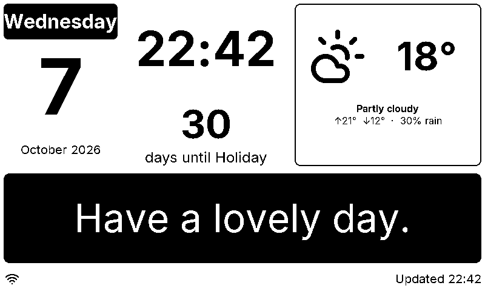
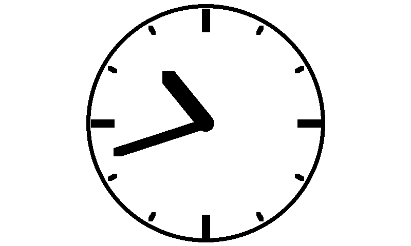

<p align="center">
  
</p>

<h1 align="center">Dither</h1>

<p align="center">
  Design an e-ink display in your browser, see exactly what it will show,<br />
  and flash it over USB. No server, no account, no phone app.
</p>

<p align="center">
  <a href="https://kayraucklnc.github.io/dither/"><b>Open the app</b></a> ·
  <a href="#get-started">Get started</a> ·
  <a href="docs/extensions.md">Write a widget</a> ·
  <a href="docs/format.md">How it works</a>
</p>

<p align="center">
  
</p>

## What it is

Dither turns a cheap e-paper panel into a calm display for your wall or desk:
the time, the weather, your next meeting, your next train, a photo, a note.

You design it in the browser and plug the panel in with a USB-C cable. After
that the panel works on its own. It wakes up every few minutes, joins your
Wi-Fi, fetches its own data, picks a screen and draws it, then goes back to
sleep. Nothing runs on your computer, and there is no cloud service in the
middle.

<p align="center">
  
  
  
</p>
<p align="center"><sub>These are exact renders. The simulator in the app and the panel use the same drawing code, so what you see in the browser is what you get on the wall, pixel for pixel.</sub></p>

## What you need

- A **Seeed Studio XIAO 7.5" ePaper Panel**
  (800 × 480, black and white, ESP32-C3 inside). It's the only display
  supported for now.
- A **USB-C data cable**. Some cables can only charge; those won't work.
- **Chrome or Edge on a computer.** Dither talks to the panel over Web Serial,
  which Safari and Firefox don't support. It also doesn't work on phones.
- Your **Wi-Fi name and password**, so the panel can get online by itself.
  It has to be a 2.4 GHz network.

## Get started

1. **Open [the app](https://kayraucklnc.github.io/dither/).** Choose your
   display, a starting layout, your city and your Wi-Fi.
2. **Make it yours.** Click a widget to change it, drag it to move it, and
   drag a corner to resize it. Use **Add widget** for more. Each screen is
   one page the panel can show.
3. **Add rules if you like.** For example, *show Night between 23:00 and
   07:00*, or *show Rainy when it's going to rain*. Alerts go on top of
   whatever screen is showing, such as *trouble on your line*.
4. **Plug in the panel and press Flash to panel.** The first flash also
   installs the firmware. After that, flashing a new design takes a few
   seconds.

<p align="center">
  
</p>

Your project is saved in your browser as you work. You can also save it to a
`.dither.json` file. A copy goes onto the panel with every flash, so you can
plug the panel into another computer and choose **Load the panel's project**
to pick up where you left off.

**If the panel doesn't show up when you connect:** it may be deep asleep, and
a sleeping panel has no USB port. Unplug it, hold the **BOOT** button, plug it
back in, then let go.

## Widgets

| Widget | Shows | Needs |
|---|---|---|
| Clock | The time, as digits or as a dial | — |
| Date | Today, like a page torn off a calendar | — |
| Weather | Now, today and the next days ([Open-Meteo](https://open-meteo.com/)) | — |
| Google Calendar | Your next event or today's agenda | A Google OAuth client (the app walks you through it) |
| Trains (Trenord) | Your next train, how late it is, and the ones after it | — |
| Revenue (Stripe) | Today's, this week's or this month's revenue, and the latest payments | A Stripe key |
| Crypto price | A coin's price and today's change ([CoinGecko](https://www.coingecko.com/)) | — |
| Number from the web | Any value from a JSON address: a sensor, a counter, a price | — |
| Countdown | Days until something you're looking forward to | — |
| Messages | A different line every day or every hour, from a list you write | — |
| Text | A heading, a note, anything you type | — |
| Picture | A photo or drawing, dithered for e-ink | — |
| Panel status | Wi-Fi, battery where the board can measure it, and when the panel last woke | — |

Keys and account links stay in your browser and on your panel. When you save
a project to a file, they're left out unless you choose to include them.

Want a widget that isn't here? A widget is one TypeScript file, and the
firmware never needs to change for it. See [Writing a widget](docs/extensions.md).

## How it works

```
┌──────────── your browser ────────────┐          ┌──── the panel ─────┐
│ screens · widgets · rules · Wi-Fi    │  USB-C   │ wakes, joins Wi-Fi │
│ simulator (same renderer as panel) ──┼─────────▶│ fetches, decides,  │
│ compile → one binary blob            │  flash   │ draws, sleeps      │
└──────────────────────────────────────┘          └────────────────────┘
```

- **The browser compiles; the panel interprets.** Everything that can be
  decided in advance (layout, fonts, icons, pictures, settings, URLs) is
  worked out in the browser and packed into a single file on the panel. The
  firmware is a small interpreter, so new widgets never need a firmware
  update.
- **Values are bound, not baked in.** A widget draws "the temperature" as a
  reference to a value. The panel fetches that value when it wakes, so the
  screen stays current between flashes.
- **One renderer, written twice, held together by tests.** The format is
  specified in [`docs/format.md`](docs/format.md). The simulator (TypeScript)
  and the firmware (C++) both implement it, and both have to draw the images
  in [`spec/fixtures/`](spec/fixtures) bit for bit.

## Run it yourself

You need [Node.js](https://nodejs.org/) 24 or newer. To build the firmware you
also need [uv](https://docs.astral.sh/uv/).

```bash
git clone https://github.com/kayraucklnc/dither.git
cd dither
make setup      # install the app's dependencies
make firmware   # build the firmware image the app flashes
make dev        # open http://localhost:5173 in Chrome or Edge
```

`make help` lists every command. Run `make test` before sending a change. It
runs the app tests, the type check, the firmware's host tests, and a
pixel-for-pixel comparison of both renderers.

| Path | What's there |
|---|---|
| [`app/`](app) | The web app: editor, simulator, compiler and USB flasher (Vite, React, TypeScript) |
| [`app/src/extensions/`](app/src/extensions) | Widgets, one folder each |
| [`firmware/`](firmware) | The panel's firmware (PlatformIO, Arduino-ESP32) |
| [`docs/format.md`](docs/format.md) | The contract between the app and the firmware |
| [`spec/fixtures/`](spec/fixtures) | Golden images that both renderers must match |
| [`tools/`](tools) | Font and icon generators (Inter and Lucide, turned into 1-bit images) |

## Contributing

Bug reports, widgets and support for new boards are all welcome. Read
[CONTRIBUTING.md](CONTRIBUTING.md) before you start.

## Licence

MIT. See [LICENSE](LICENSE). The bundled Inter font is under the SIL Open Font
Licence and the Lucide icons are under ISC. Their licences ship next to the
generated assets.
