<p align="center">
  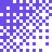
</p>

<h1 align="center">Dither</h1>

<p align="center">
  Design an e-ink display in your browser, see exactly what it will show,<br />
  and flash it over USB. No server, no account, no phone app.
</p>

<p align="center">
  <a href="https://kayraucklnc.github.io/dither/"><b>Open the app</b></a> ·
  <a href="#get-started">Get started</a> ·
  <a href="#make-your-own-widget">Make a widget</a> ·
  <a href="#roadmap">Roadmap</a> ·
  <a href="docs/format.md">The format</a>
</p>

<p align="center">
  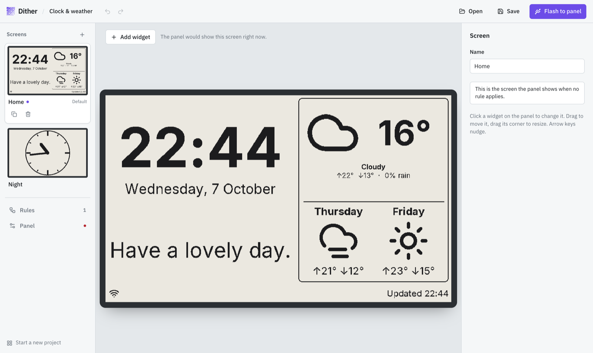
</p>

## What it is

Dither turns a cheap e-paper panel into a calm display for your wall or desk:
the time, the weather, your next meeting, your next train, today's revenue,
a photo, a note.

You design it in the browser and plug the panel in with a USB-C cable. After
that the panel works on its own. It wakes up every few minutes, joins your
Wi-Fi, fetches its own data, picks a screen and draws it, then goes back to
sleep. Nothing runs on your computer, and there is no cloud service in the
middle.

## What it looks like

These are exact renders. The simulator in the app and the panel use the same
drawing code, so what you see in the browser is what you get on the wall,
pixel for pixel.

<table>
  <tr>
    <td colspan="2" align="center">
      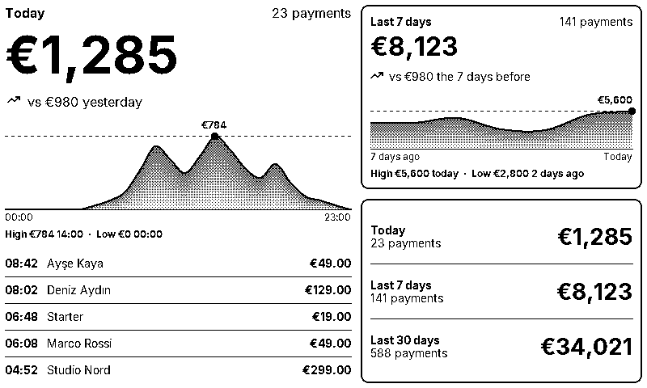<br />
      <b>Revenue from Stripe.</b> Smooth curves shaded with dithering, highs and lows, the latest payments, and totals over 1, 7 and 30 days.
    </td>
  </tr>
  <tr>
    <td width="50%" align="center">
      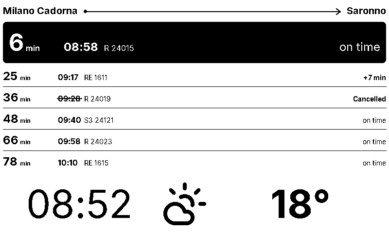<br />
      <b>Your trains.</b> Minutes until the next one, delays and cancellations.
    </td>
    <td width="50%" align="center">
      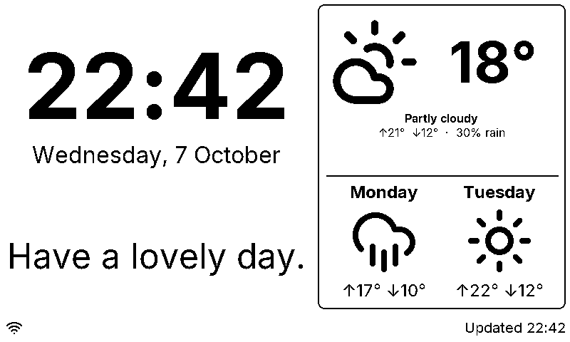<br />
      <b>Clock and weather.</b> No account needed.
    </td>
  </tr>
  <tr>
    <td width="50%" align="center">
      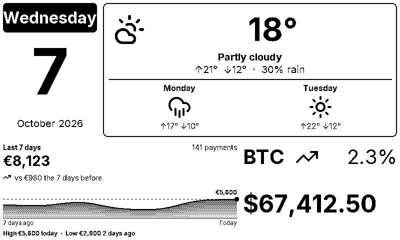<br />
      <b>Weekend.</b> Date, forecast, the week's revenue and a coin price.
    </td>
    <td width="50%" align="center">
      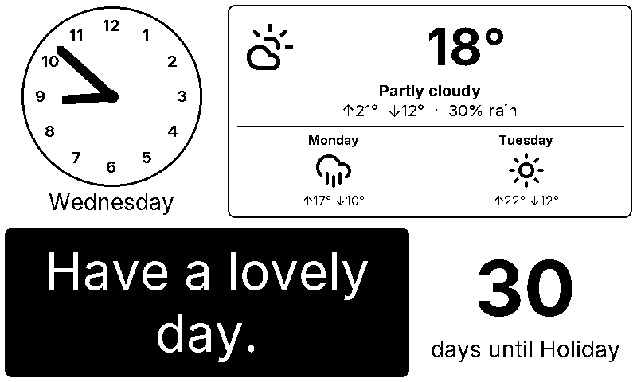<br />
      <b>Evening.</b> A clock face, a message and a countdown.
    </td>
  </tr>
</table>

## What you need

- A **Seeed Studio XIAO 7.5" ePaper Panel** (800 × 480, black and white,
  ESP32-C3 inside). It's the only display supported for now.
- A **USB-C data cable**. Some cables can only charge; those won't work.
- **Chrome or Edge on a computer.** Dither talks to the panel over Web Serial,
  which Safari and Firefox don't support. It also doesn't work on phones.
- Your **Wi-Fi name and password**, so the panel can get online by itself.
  It has to be a 2.4 GHz network.

## Get started

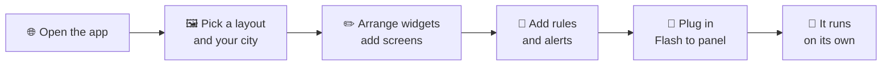
```mermaid
flowchart LR
    A["🌐 Open the app"] --> B["🖼️ Pick a layout<br/>and your city"]
    B --> C["✏️ Arrange widgets<br/>add screens"]
    C --> D["🔀 Add rules<br/>and alerts"]
    D --> E["🔌 Plug in<br/>Flash to panel"]
    E --> F["🖤 It runs<br/>on its own"]
```

1. **Open [the app](https://kayraucklnc.github.io/dither/).** Choose your
   display, a starting layout, your city and your Wi-Fi. If you want to see
   everything at once, pick **A whole day**.
2. **Make it yours.** Click a widget to change it, drag it to move it, and
   drag a corner to resize it. Use **Add widget** for more. Each screen is
   one page the panel can show.
3. **Add rules if you like.** For example, *show Night between 23:00 and
   06:00*, or *show Commute on weekdays when my next train leaves in under 25
   minutes*. Alerts go on top of whatever screen is showing, such as *trouble
   on your line*. Use **Try it** to move the clock or the weather and see
   which screen would show.
4. **Plug in the panel and press Flash to panel.** The first flash also
   installs the firmware. After that, flashing a new design takes a few
   seconds.

<p align="center">
  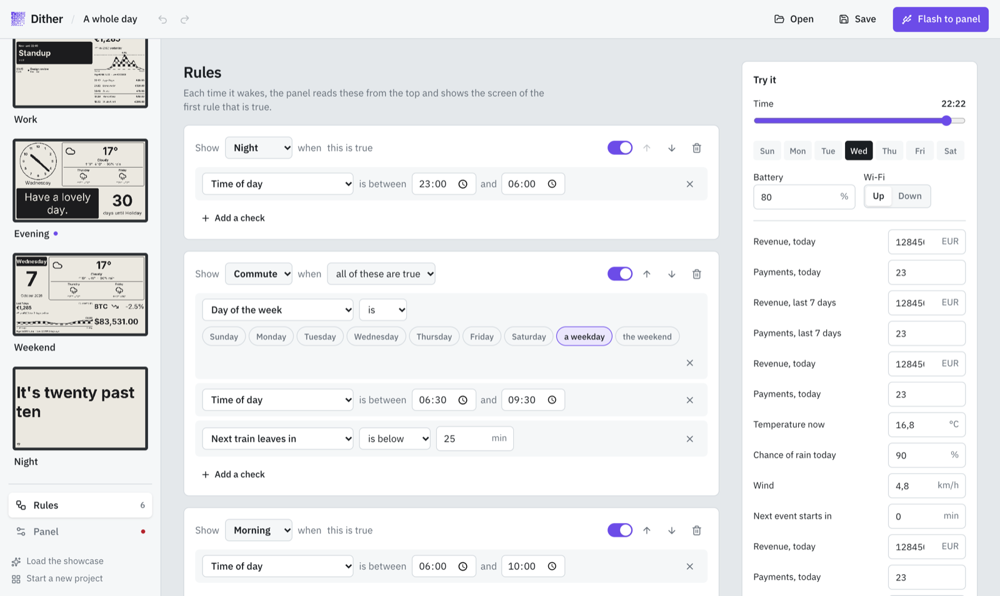
</p>

Your project is saved in your browser as you work. You can also save it to a
`.dither.json` file. A copy goes onto the panel with every flash, so you can
plug the panel into another computer and choose **Load the panel's project**
to pick up where you left off.

**If the panel doesn't show up when you connect:** it may be deep asleep, and
a sleeping panel has no USB port. Unplug it, hold the **BOOT** button, plug it
back in, then let go.

## Widgets

| | Widget | Shows | Needs |
|---|---|---|---|
| 🕰️ | Clock | The time as digits, flip tiles, a dial or words | — |
| 📅 | Date | Today, like a page torn off a calendar | — |
| ⛅ | Weather | Now, today and the next days ([Open-Meteo](https://open-meteo.com/)) | — |
| 🗓️ | Google Calendar | Every linked account as one agenda: now, next, and the rest of the day | A Google OAuth client (the app walks you through it) |
| 🚆 | Trains (Trenord) | Your next train, how late it is, and the ones after it | — |
| 💶 | Revenue (Stripe) | A figure, a smooth graph, a ledger or a full board with payments | A restricted Stripe key |
| ₿ | Crypto price | A coin's price and today's change ([CoinGecko](https://www.coingecko.com/)) | — |
| 🔢 | Number from the web | Any value from a JSON address: a sensor, a counter, a price | — |
| ⏳ | Countdown | Days until something you're looking forward to | — |
| 💬 | Messages | A different line every day or every hour, from a list you write | — |
| ✍️ | Text | A heading, a note, anything you type | — |
| 🖼️ | Picture | A photo or drawing, dithered for e-ink | — |
| 📶 | Panel status | Wi-Fi, battery where the board can measure it, and when the panel last woke | — |

Keys and account links stay in your browser and on your panel. When you save
a project to a file, they're left out unless you choose to include them.

## How it works

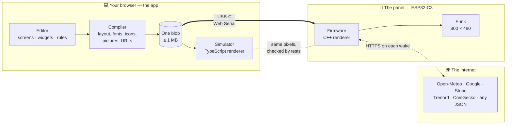
```mermaid
flowchart LR
    subgraph browser["💻 Your browser — the app"]
        direction TB
        ED["Editor<br/>screens · widgets · rules"] --> CO["Compiler<br/>layout, fonts, icons,<br/>pictures, URLs"]
        CO --> BL[("One blob<br/>≤ 1 MB")]
        BL --> SIM["Simulator<br/>TypeScript renderer"]
    end

    subgraph panel["🖤 The panel — ESP32-C3"]
        direction TB
        FW["Firmware<br/>C++ renderer"] --> EP["E-ink<br/>800 × 480"]
    end

    subgraph web["🌍 The internet"]
        direction TB
        API["Open-Meteo · Google · Stripe<br/>Trenord · CoinGecko · any JSON"]
    end

    BL == "USB-C<br/>Web Serial" ==> FW
    FW <-. "HTTPS on each wake" .-> API
    SIM -. "same pixels,<br/>checked by tests" .- FW
```

- **The browser compiles; the panel interprets.** Everything that can be
  decided in advance (layout, fonts, icons, pictures, settings, URLs) is
  worked out in the browser and packed into a single blob on the panel. The
  firmware is a small interpreter, so new widgets never need a firmware
  update.
- **Values are bound, not baked in.** A widget draws "the temperature" as a
  reference to a value. The panel fetches that value when it wakes, so the
  screen stays current between flashes.
- **One renderer, written twice, held together by tests.** The format is
  specified in [`docs/format.md`](docs/format.md). The simulator (TypeScript)
  and the firmware (C++) both implement it, and both have to draw the images
  in [`spec/fixtures/`](spec/fixtures) bit for bit.

Every few minutes, the panel goes through one wake:

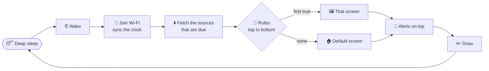
```mermaid
flowchart LR
    S(["😴 Deep sleep"]) --> W["⏰ Wake"]
    W --> N["📶 Join Wi-Fi<br/>sync the clock"]
    N --> F["⬇️ Fetch the sources<br/>that are due"]
    F --> R{"🔀 Rules<br/>top to bottom"}
    R -->|first true| SC["🖼️ That screen"]
    R -->|none| DF["🏠 Default screen"]
    SC --> AL["🚨 Alerts on top"]
    DF --> AL
    AL --> D["✏️ Draw"]
    D --> S
```

Values the panel fetched survive sleep, so a screen still draws when Wi-Fi is
down. While it's plugged into a computer, the panel stays awake so the app
can always reach it.

## Make your own widget

A widget is **one TypeScript file** in `app/src/extensions/`. You never touch
the firmware. The widget says what settings it has, what to fetch, what rules
can ask about it, and how it looks. The compiler turns that into things the
panel already knows how to do.

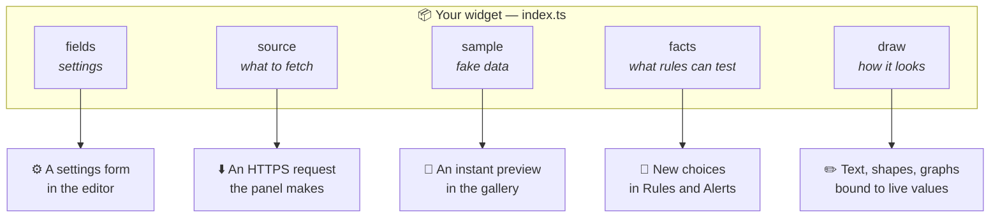
```mermaid
flowchart TB
    subgraph ext["📦 Your widget — index.ts"]
        direction LR
        FI["fields<br/><i>settings</i>"]
        SO["source<br/><i>what to fetch</i>"]
        SA["sample<br/><i>fake data</i>"]
        FA["facts<br/><i>what rules can test</i>"]
        DR["draw<br/><i>how it looks</i>"]
    end

    FI --> FORM["⚙️ A settings form<br/>in the editor"]
    SO --> FETCH["⬇️ An HTTPS request<br/>the panel makes"]
    SA --> PREV["👀 An instant preview<br/>in the gallery"]
    FA --> RULES["🔀 New choices<br/>in Rules and Alerts"]
    DR --> LAYOUT["✏️ Text, shapes, graphs<br/>bound to live values"]
```

Here's a complete widget that shows today's visitors from an analytics API:

```ts
import { defineExtension } from "../api";

export default defineExtension({
  id: "visitors",
  name: "Visitors",
  description: "Today's visitors, from your analytics.",
  icon: "globe",
  category: "data",
  size: { min: [3, 2], default: [5, 3] },
  fields: [{ key: "site", label: "Site", kind: "text" }],
  defaults: () => ({ site: "" }),
  source: (s) => s.site ? {
    url: `https://stats.example.com/api/${s.site}/today`,
    every: 30,                                         // minutes between fetches
    values: { count: "visitors", trend: "change.percent" }, // JSON paths to keep
  } : null,
  sample: () => ({ count: 1834, trend: 12.5 }),
  facts: () => [{ key: "count", label: "Visitors today", type: "number", value: "count" }],
  draw(d) {
    const size = d.fit(["88,888"], d.width, d.height * 0.7, { weight: 700 });
    d.text(d.value("count", { num: { d: 0, sep: "," } }), { x: 0, y: 0, w: d.width, h: d.height * 0.7, size, weight: 700 });
    d.text(["Visitors · ", d.value("trend", { num: { d: 1 } }), "%"], { x: 0, y: d.height * 0.7, w: d.width, h: d.height * 0.3, size: 20 });
  },
});
```

Add one line to `app/src/extensions/index.ts` and it shows up in the widget
gallery with its sample data. Because rules can test `count`, *show the Launch
screen when visitors today is above 10,000* now works too.

### Connecting to a service

The panel makes plain HTTPS GET requests and reads JSON. Most services fit one
of these patterns, and there's a bundled widget to copy for each:

| The service needs | Use in `source` | Copy from |
|---|---|---|
| Nothing, it's public JSON | `url` and `values` | Weather, Crypto, Number from the web |
| An API key | a `secret` field and `headers: [["Authorization", "Bearer …"]]` | Stripe |
| An OAuth login | `auth`: the panel trades a refresh token for an access token on each wake | Google Calendar |
| Totals or a graph from a list | `values: { x: { path, agg: "sum" \| "count" \| "buckets" } }` | Stripe |
| An encrypted reply | `decode: { aes256ecb: key }` | Trains (Trenord) |
| The date or time in the URL | `{{now\|YYYY-MM-DD}}`, `{{today-86400}}` | Google Calendar, Stripe |

The panel can't run JavaScript, follow a login page, or read anything other
than JSON. If a service needs any of those, it isn't a fit yet.

The full guide, with layout tips and the whole `Draw` API, is
[docs/extensions.md](docs/extensions.md).

## Roadmap

✅ done · ⬜ ideas, and help is welcome. Open an issue if you'd like to pick one up.

**Editor and app**
- ✅ Design screens in the browser: drag, resize, undo and redo
- ✅ Simulator that matches the panel pixel for pixel
- ✅ Rules that switch screens by time, day, weather, trains, meetings or revenue
- ✅ Alerts that go on top of any screen
- ✅ **Try it**: move the clock and the data, and see which screen would show
- ✅ Starter layouts, including *A whole day* with every widget
- ✅ Projects saved in the browser, to a file and on the panel itself
- ✅ Hosted on GitHub Pages, so there's nothing to install
- ⬜ Share a design as a link or a gallery of community layouts
- ⬜ Several panels in one project
- ⬜ The editor in more languages
- ⬜ Works offline as an installable app (PWA)

**Panel and firmware**
- ✅ Flash the firmware and the design from the browser over USB
- ✅ Deep sleep between wakes, and awake while plugged in
- ✅ Its own time-zone engine, so the panel and the preview always agree
- ✅ Fonts trimmed to the characters a screen can show
- ✅ Cached values, so a screen still draws when Wi-Fi drops
- ✅ OAuth refresh, encrypted replies and list totals on the panel
- ✅ Smooth, dithered graphs drawn on the panel
- ⬜ Update the design over Wi-Fi, without a cable
- ⬜ Set up Wi-Fi from a phone over Bluetooth
- ⬜ Only refresh the parts of the screen that changed
- ⬜ More boards: Waveshare panels, TRMNL, Inkplate, M5Paper
- ⬜ Grey levels and red/yellow panels
- ⬜ Battery measurement on boards that wire it up

**Widgets and connectors**
- ✅ Clock: digits, flip tiles, a dial or words
- ✅ Weather from Open-Meteo, with no account
- ✅ Google Calendar, several accounts merged into one agenda
- ✅ Stripe: figure, curved graph, ledger and payments board
- ✅ Trains from Trenord, with delays, cancellations and line alerts
- ✅ Crypto prices, countdowns, messages, pictures, text and any JSON value
- ⬜ Any calendar from an iCal link, with no OAuth
- ⬜ Public transport anywhere through GTFS-Realtime, plus TfL, SBB, BVG and NS
- ⬜ Home Assistant: sensors, rooms and switches
- ⬜ Air quality, pollen, UV, sunrise and sunset, moon phase
- ⬜ GitHub: open PRs, CI status, a contribution graph
- ⬜ Analytics: Plausible, Umami, Google Analytics
- ⬜ Tasks: Todoist, Linear, Notion
- ⬜ News headlines from RSS
- ⬜ Spotify: what's playing
- ⬜ Strava: this week's runs and rides
- ⬜ A QR code widget, for guest Wi-Fi or a link
- ⬜ A graph widget for any number series from a JSON address

## Run it yourself

You need [Node.js](https://nodejs.org/) 24 or newer. To build the firmware you
also need [uv](https://docs.astral.sh/uv/).

```bash
git clone https://github.com/kayraucklnc/dither.git
cd dither
make setup      # install the app's dependencies
make firmware   # build the firmware image the app flashes
make dev        # open http://localhost:5173 in Chrome or Edge
```

`make help` lists every command. Run `make test` before sending a change. It
runs the app tests, the type check, the firmware's host tests, and a
pixel-for-pixel comparison of both renderers.

| Path | What's there |
|---|---|
| [`app/`](app) | The web app: editor, simulator, compiler and USB flasher (Vite, React, TypeScript) |
| [`app/src/extensions/`](app/src/extensions) | Widgets, one folder each |
| [`firmware/`](firmware) | The panel's firmware (PlatformIO, Arduino-ESP32) |
| [`docs/format.md`](docs/format.md) | The contract between the app and the firmware |
| [`spec/fixtures/`](spec/fixtures) | Golden images that both renderers must match |
| [`tools/`](tools) | Font and icon generators (Inter and Lucide, turned into 1-bit images) |

## Contributing

Bug reports, widgets and support for new boards are all welcome. Read
[CONTRIBUTING.md](CONTRIBUTING.md) before you start.

## Licence

MIT. See [LICENSE](LICENSE). The bundled Inter font is under the SIL Open Font
Licence and the Lucide icons are under ISC. Their licences ship next to the
generated assets.
